# Создание пакетов в Python через uv


Подробная инструкция по созданию собственного пакета Python через uv на примере Windows 11.

## Содержание

- [Подготовка](#подготовка)
- [Создание проекта](#создание-проекта)
- [Установка пакетов](#установка-пакетов)
- [Создание пакета](#создание-пакета)
- [Тестирование пакета](#тестирование-пакета)
- [Сборка пакета и публикация на PyPi](#сборка-пакета-и-публикация-на-pypi)
- [Использование пакета, опубликованного на PyPi](#использование-пакета-опубликованного-на-pypi)
- [Использование пакета, опубликованного на PyPi, с pip](#использование-пакета-опубликованного-на-pypi-с-pip)
- [Публикация новой версии пакета](#публикация-новой-версии-пакета)
- [Развертывание разработки пакета на новой машине](#развертывание-разработки-пакета-на-новой-машине)
- [Установка локального пакета](#установка-локального-пакета)

Пакет, созданный в рамках этой статьи:

- <https://github.com/Harrix/harrix-test-package>
- <https://pypi.org/project/harrix-test-package>

Официальная документация:

- [uv](https://docs.astral.sh/uv/) — сайт инструмента.
- <https://packaging.python.org/tutorials/packaging-projects>
- <https://github.com/pypa/sampleproject>

Буду показывать на примере VSCode, но вы можете использовать другой редактор и терминал.

## Подготовка

Установите и настройте uv, например, по статье [Установка и работа с uv (Python) в VSCode](https://github.com/Harrix/harrix.dev-articles-2025/blob/main/uv-vscode-python/uv-vscode-python.md) | [🡥](https://harrix.dev/ru/articles/2025/uv-vscode-python/).

## Создание проекта

У меня проект будет называться `harrix-test-package` (но импортироваться будет как `harrix_test_package`). Для своего проекта выберите своё название. Между словами в названии проекта ставьте дефис, а не пробел или символ нижнего подчеркивания.

Откройте в VSCode папку с проектами через `File` → `Open Folder...`, например, `C:\python-projects`, вызовете там терминал `Ctrl` + `` ` `` и создайте проект uv через команду (разумеется, у вас будет другое название проекта):

```shell
uv init --package harrix-test-package
```

Теперь в VScode откройте созданную папку `C:\python-projects\harrix-test-package`, откройте опять терминал через `Ctrl` + `` ` ``:

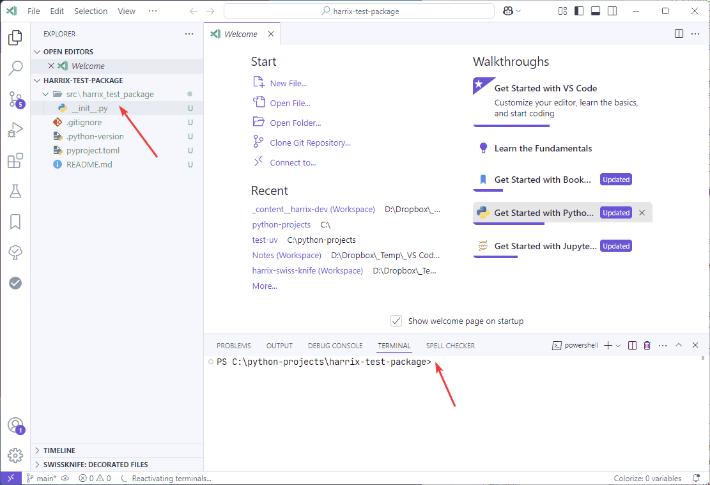

_Рисунок 1 — Созданный пустой проект_

Обратите внимание, что структура проекта более сложная, чем было бы при вызове команды `uv init harrix-test-package`, так как к пакету предъявляется больше требований.

Создайте под свой проект виртуальное окружение. У меня виртуальное окружение будет находиться в папке `.venv`, находящейся в папке с проектом:

```python
uv sync
```

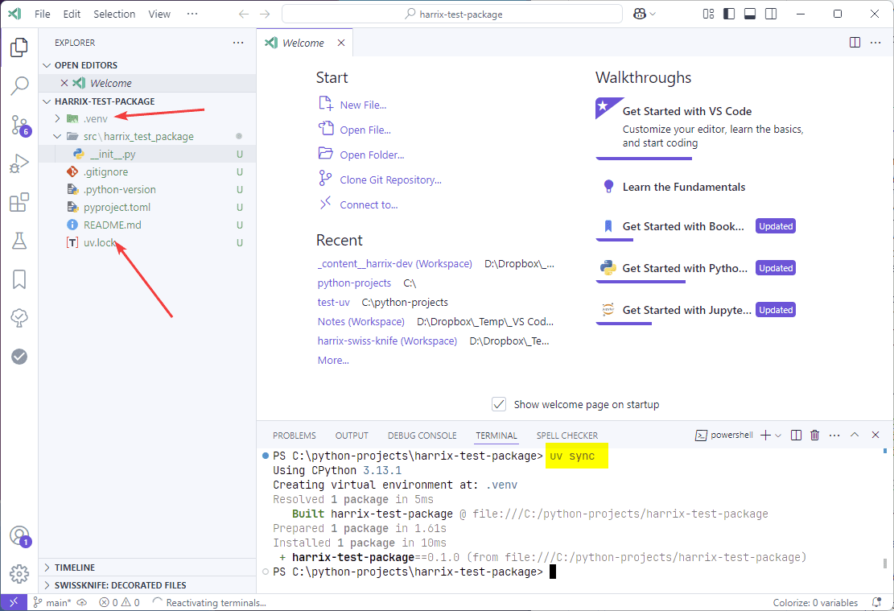

_Рисунок 2 — Вызов uv sync_

## Установка пакетов

Для тестирования внедрения сторонних пакетов в нашу библиотеку установим два популярных пакета `numpy` и `isort`. Причем второй пакет будем устанавливать в режиме `--dev`, так как этот пакет нужен для разработки нашей библиотеки, но не нужен человеку, который установит наш пакет. Также устанавливаем библиотеку `pytest` для тестирования библиотеки и `ruff` для форматирования и проверки кода.

```python
uv add numpy
uv add --dev isort
uv add --dev ruff
uv add --dev pytest
```

Информация об установленных библиотеках будет располагаться в файлах:

- `pyproject.toml`
- `uv.lock`

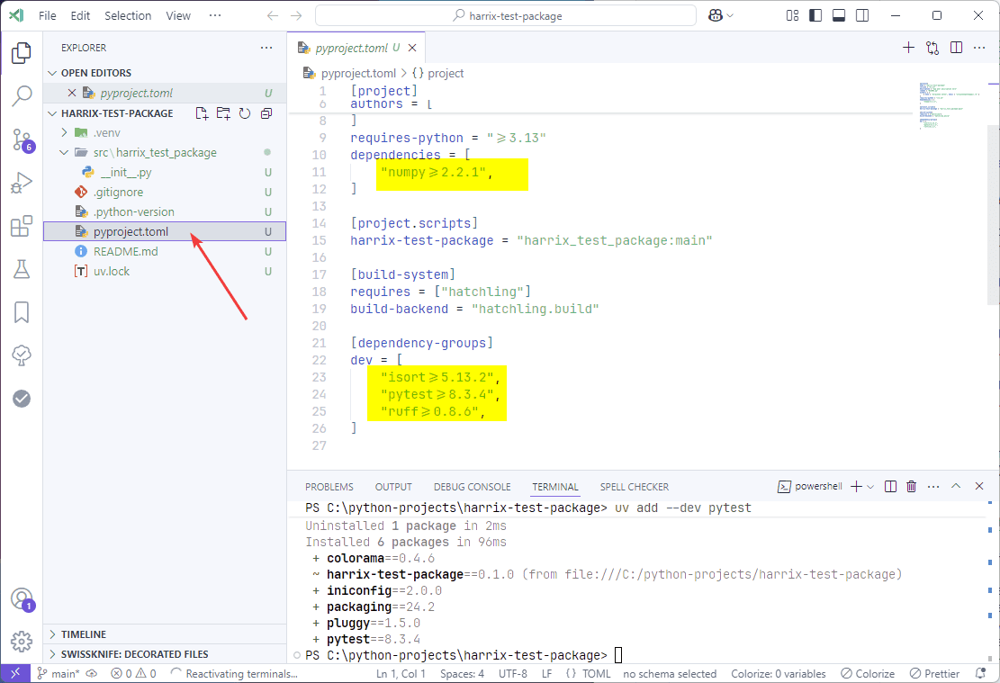

_Рисунок 3 — Установленные библиотеки_

## Создание пакета

У нас будет простой пакет с тремя функциями:

```python
import numpy as np

def multiply_2(x):
    return x * 2


def multiply_10(x):
    return x * 10


def test_numpy():
    return np.arange(-2, 2, 0.5)
```

Для этого создаем файл `functions.py` (у вас он будет называться по другому) в в папке `src\harrix_test_package` и поместим вышеприведенный код:

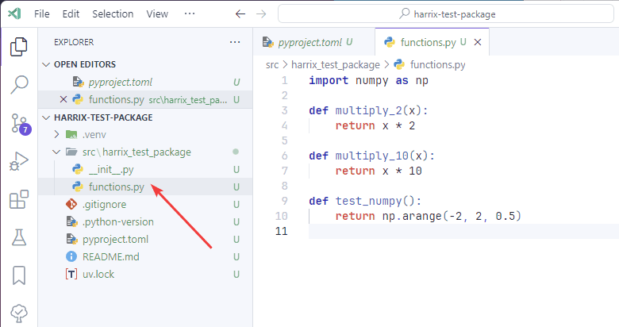

_Рисунок 4 — Файл functions.py_

Обратите внимание, что внутри папки `src` располагается название пакета в том виде, в котором я буду его импортировать в других проектах. И в этом названии дефисы использовать нельзя по правилам синтаксиса Python. Поэтому папка называется `harrix_test_package` (без дефисов), а не `harrix-test-package`.

Файл `src\harrix_test_package\__init__.py` импортирует всё то, что есть в нашем пакете для пользователей:

```python
from .functions import *
```

Проверку нашего пакета будем делать через [pytest](https://docs.pytest.org/en/stable/) (он используется в uv по умолчанию). Именно для этого выше мы его устанавливали через `uv add --dev pytest`:

Для тестов создадим папку `tests` с файлами тестов. Не забудьте, что название файла тестов должно начинаться с `test_`

Файл `tests\test_functions.py`:

```python
import harrix_test_package as h


def test_multiply_2():
    re = h.multiply_2(2)
    assert re == 4


def test_multiply_10():
    re = h.multiply_10(2)
    assert re == 20


def test_test_numpy():
    re = len(h.test_numpy())
    assert re == 8
```

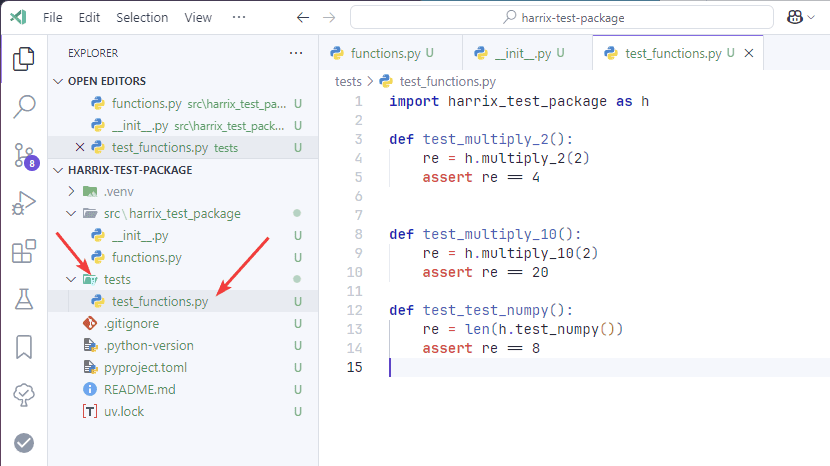

_Рисунок 5 — Файл с тестами функций_

Теперь рассмотрим файлы настроек проекта.

Файл `pyproject.toml` с внесенными изменениями:

```toml
[project]
name = "harrix-test-package"
version = "0.7"
description = "Test package"
readme = "README.md"
authors = [{ name = "Anton Sergienko", email = "anton.b.sergienko@gmail.com" }]
requires-python = ">=3.13"
dependencies = ["numpy>=2.2.1"]
license = { file = "LICENSE.md" }

[project.urls]
Homepage = "https://github.com/Harrix/harrix-test-package"

[project.scripts]
harrix-test-package = "harrix_test_package:main"

[build-system]
requires = ["hatchling"]
build-backend = "hatchling.build"

[dependency-groups]
dev = ["isort>=5.13.2", "pytest>=8.3.4", "ruff>=0.8.6"]

[tool.ruff]
line-length = 120
```

У меня версия пакета равна `0.7`, так как этот пакет уже использовался для экспериментов по созданию пакета другими средствами Python. У вас же она будет равна скорее всего `0.1`, `0.0.1` или `1.0` — всё зависит от выбранной вами нумерации версий пакетов.

Параметры `name`, `description`, `Homepage`, `authors` поменяйте под себя. Раздел `project.urls` добавил вручную, так что, если у вас нет страницы проекта, то можно удалить. Аналогично со строкой `license = {file = "LICENSE.md"}`.

Для форматирования кода в 120 символов через ruff вставлены следующие настройки:

```toml
[tool.ruff]
line-length = 120
```

Также я для тестового примера оставил минимальную версию Python по умолчанию, и это последняя версия Python: `requires-python = ">=3.13"`, но возможно вы захотите свой пакет сделать более универсальным и понизите версию пакета.

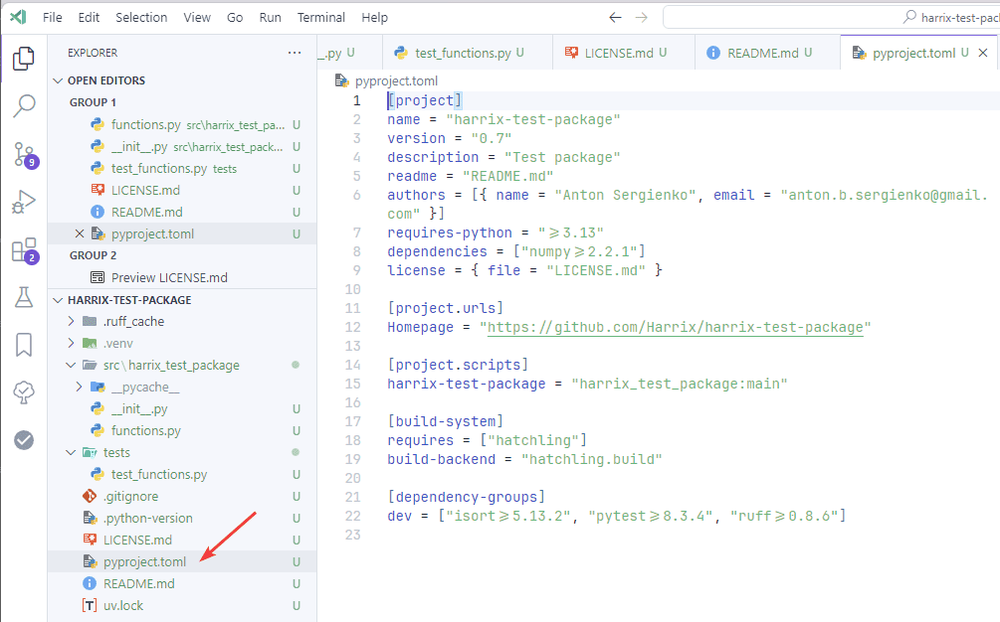

_Рисунок 6 — Файл pyproject.toml_

Создадим файл лицензии `LICENSE.md`, в котором располагается текст вашей лицензии. У меня это [MIT лицензия](https://en.wikipedia.org/wiki/MIT_License). Блок `[Year] [Your name]` поменяйте под себя:

```markdown
# The MIT License

Copyright © [Year] [Your name]

Permission is hereby granted, free of charge, to any person obtaining a copy of this software and associated documentation files (the "Software"), to deal in the Software without restriction, including without limitation the rights to use, copy, modify, merge, publish, distribute, sublicense, and/or sell copies of the Software, and to permit persons to whom the Software is furnished to do so, subject to the following conditions:

The above copyright notice and this permission notice shall be included in all copies or substantial portions of the Software.

THE SOFTWARE IS PROVIDED "AS IS", WITHOUT WARRANTY OF ANY KIND, EXPRESS OR IMPLIED, INCLUDING BUT NOT LIMITED TO THE WARRANTIES OF MERCHANTABILITY, FITNESS FOR A PARTICULAR PURPOSE AND NONINFRINGEMENT. IN NO EVENT SHALL THE AUTHORS OR COPYRIGHT HOLDERS BE LIABLE FOR ANY CLAIM, DAMAGES OR OTHER LIABILITY, WHETHER IN AN ACTION OF CONTRACT, TORT OR OTHERWISE, ARISING FROM, OUT OF OR IN CONNECTION WITH THE SOFTWARE OR THE USE OR OTHER DEALINGS IN THE SOFTWARE.
```

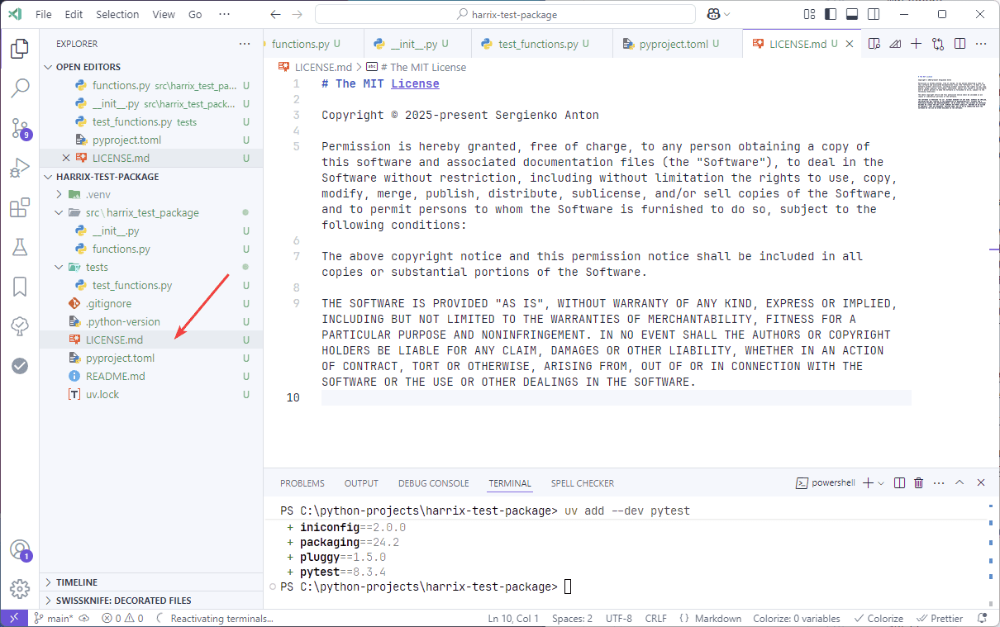

_Рисунок 7 — Файл LICENSE_

Файл `README.md` содержит описание вашего пакета в формате [Markdown](https://ru.wikipedia.org/wiki/Markdown). Оно может быть любым. У меня оно такое:

````markdown
# harrix-test-package

Test package.

## Install

```shell
pip install harrix-test-package
```

```shell
uv add harrix-test-package
```

## Using

```python
import harrix_test_package as h


print(h.multiply_2(2))
```
````

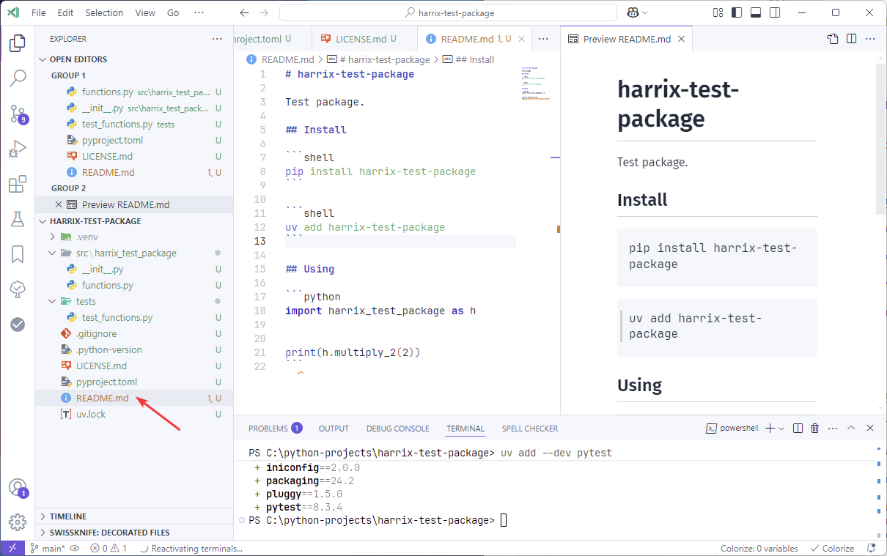

_Рисунок 8 — Файл README.md_

## Тестирование пакета

Мы уже создали папку `tests` с файлом тестов, а также установили `pytest` (если не установили, то установите через `uv add --dev pytest`). Так что для тестирования пакета нужно только запустить команду в терминале:

```shell
pytest
```

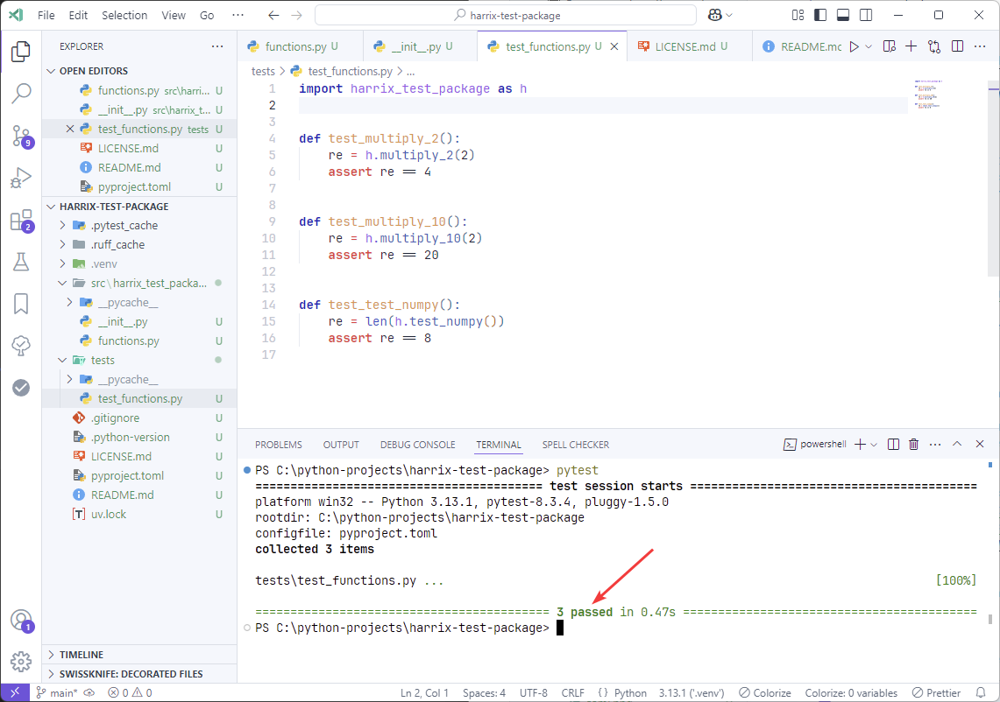

_Рисунок 9 — Результат тестирования пакета_

Устанавливать наш пакет в режиме разработчика, как в pip, не нужно.

Если видите ошибку такого плана, то мне помогла простая перезагрузка компа:

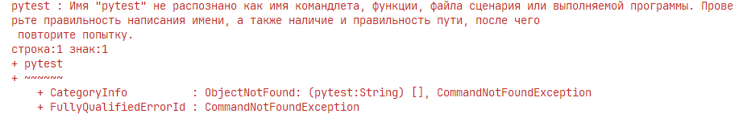

_Рисунок 10 — alt text_

## Сборка пакета и публикация на PyPi

Зарегистрируйтесь на [PyPi](https://pypi.org/account/register/). Также там нужно будет [настроить двуфакторную авторизацию](https://pypi.org/manage/account/two-factor/). Я для этого использовал Microsoft Authenticator.

Соберите пакет для публикации и опубликуйте:

```shell
uv build
```

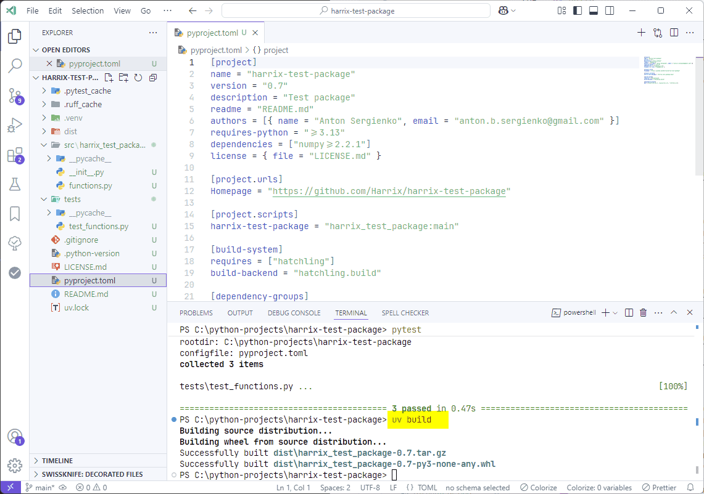

_Рисунок 11 — Процесс сборки пакета_

Отправьте пакет на тестовый сервер:

```python
uv publish --token pypi-Qwerty1234567890QwertyQwerty1234567890Qwerty1234567890Qwerty1234567890Qwerty1234567890Qwerty1234567890Qwerty1234567890Qwerty1234567890Qwerty1234567890Qwerty1234567890Qwerty12
```

Вам нужен свой токен, этот представленный выше не подойдет, конечно.

Этот токен который вы можете сгенерировать на странице <https://pypi.org/manage/account/token/>. Если вас попросят какой-то код аутентификации, то у вас настроена двуфакторная авторизация, и надо этот код получить вашим настроенным способом. У меня это Microsoft Authenticator. Итак, этап с кодом прошли, так что создаем токен:

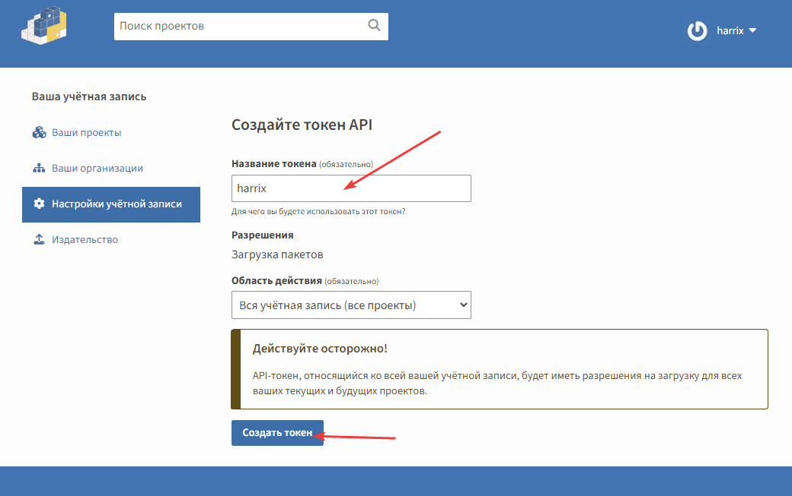

_Рисунок 12 — Создание токена_

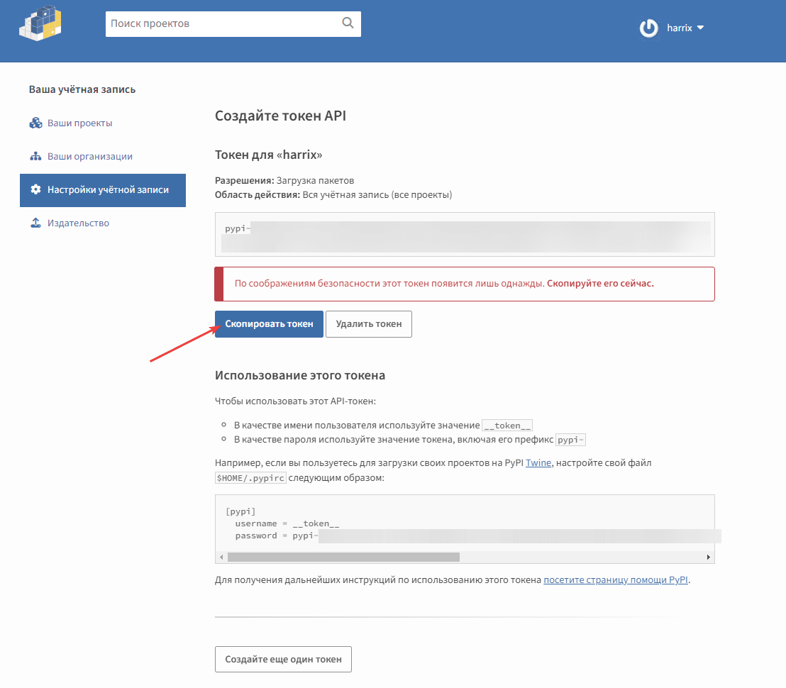

_Рисунок 13 — Созданный токен_

Копируем и вставляете в команду представленную выше в VSCode, жмете `Enter`, процесс пошел.

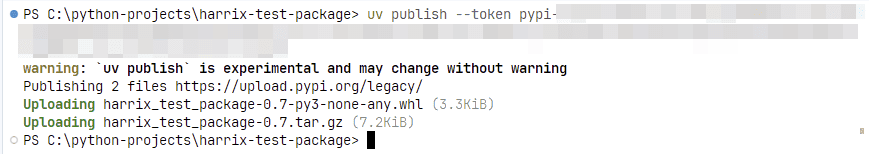

_Рисунок 14 — Публикация пакета_

Теперь по ссылке <https://pypi.org/project/harrix-test-package/0.7/> можно посмотреть на опубликованный пакет:

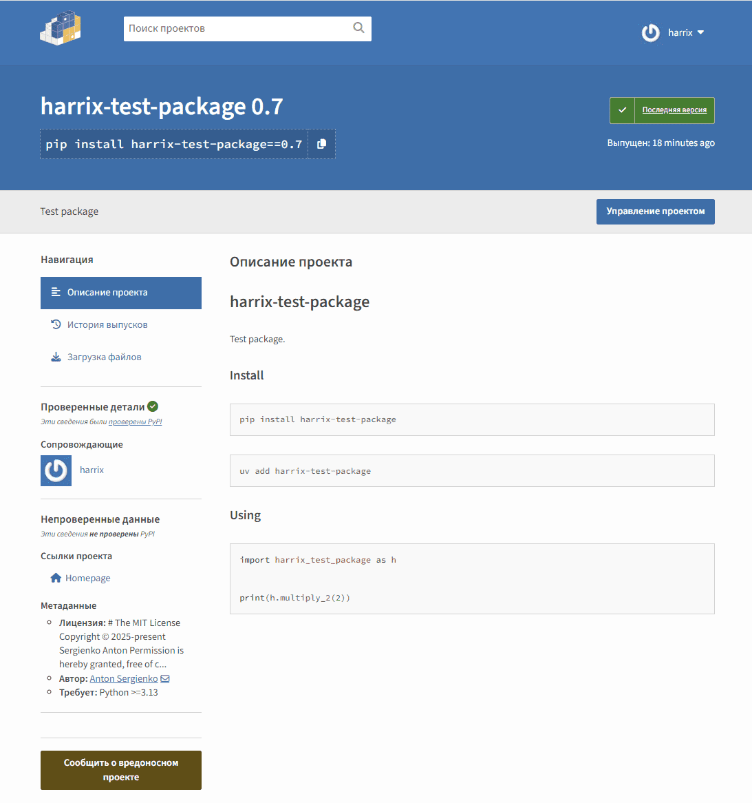

_Рисунок 15 — Опубликованный пакет_

Иногда, если вы забыли поменять версию пакета, его собрали, исправили версию, пересобрали пакет и отправили на сервер, то выдается ошибка о том, что пакет там уже есть. Нужно удалить папку `dist`, пересобрать исправленный вариант, отправить заново:

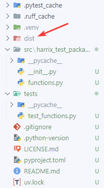

_Рисунок 16 — Папка dist_

## Использование пакета, опубликованного на PyPi

Для проверки опубликованного пакета создаем новый Python проект с использованием uv (например, с именем `test`) со своим виртуальным окружением, куда установлю опубликованный пакет. Можно сделать [обычным способом](https://github.com/Harrix/harrix.dev-articles-2025/blob/main/uv-vscode-python/uv-vscode-python.md) | [🡥](https://harrix.dev/ru/articles/2025/uv-vscode-python.md/), а можно через консоль с открытием проекта в VSCode. Привожу код для Windows через PowerShell:

```shell
cd C:\python-projects
uv init test
cd test
uv sync
uv add harrix-test-package
code C:\python-projects\test
```

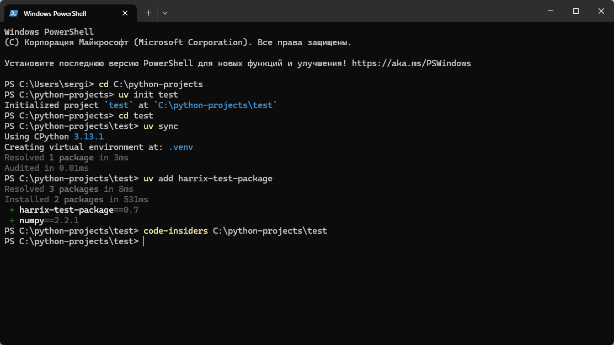

_Рисунок 17 — Выполнение команд в терминале_

Так как я использую Visual Studio Code Insiders, то последняя строчка у меня выглядит как `code-insiders C:\python-projects\test`

В файле `src\main.py` внесем пример кода:

```python
import harrix_test_package as h

print(h.multiply_2(2))

print(h.multiply_10(2))

print(len(h.test_numpy()))
```

Запустим код:

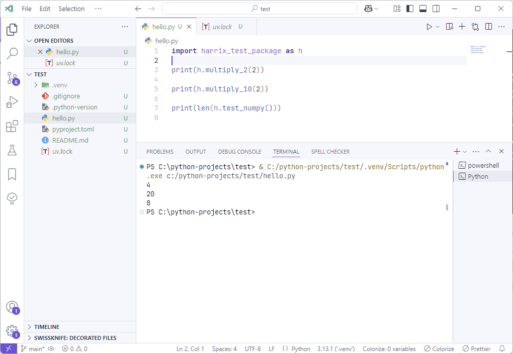

_Рисунок 18 — Использование пакета_

## Использование пакета, опубликованного на PyPi, с pip

Пакет, который был создан — универсальный. Его можно использовать не только в проектах с uv. Давайте создадим пустой проект в PyCharm c стандартным `venv`.

В терминале напишем `pip install harrix-test-package`:

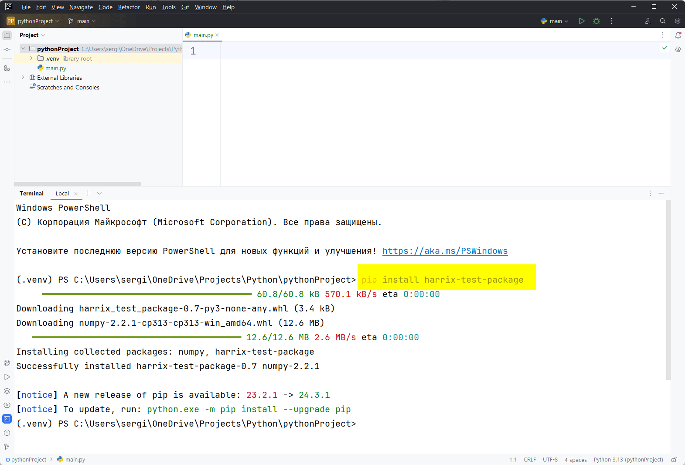

_Рисунок 19 — Установка пакета в PyCharm_

Напишем код использования библиотеки и запустим. Всё работает:

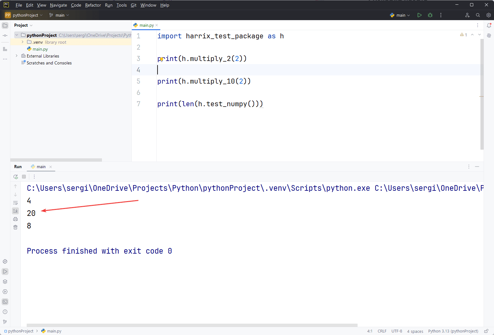

_Рисунок 20 — Запуск кода с использованием пакета_

## Публикация новой версии пакета

Попробуем добавить новую функцию в пакет и опубликовать новую версию. Итак, мега полезная функция:

```python
def multiply_20(x):
    return x * 20
```

После добавления файл `src\harrix_test_package\functions.py` примет вид:

```python
import numpy as np


def multiply_2(x):
    return x * 2


def multiply_10(x):
    return x * 10


def test_numpy():
    return np.arange(-2, 2, 0.5)


def multiply_20(x):
    return x * 20
```

Также добавим новый тест в файл `tests\test_functions.py`:

```python
import harrix_test_package as h


def test_multiply_2():
    re = h.multiply_2(2)
    assert re == 4


def test_multiply_10():
    re = h.multiply_10(2)
    assert re == 20


def test_test_numpy():
    re = len(h.test_numpy())
    assert re == 8

def test_multiply_20():
    re = h.multiply_20(2)
    assert re == 40
```

Теперь надо запустить тесты:

```shell
pytest
```

Тесты успешно пройдены:

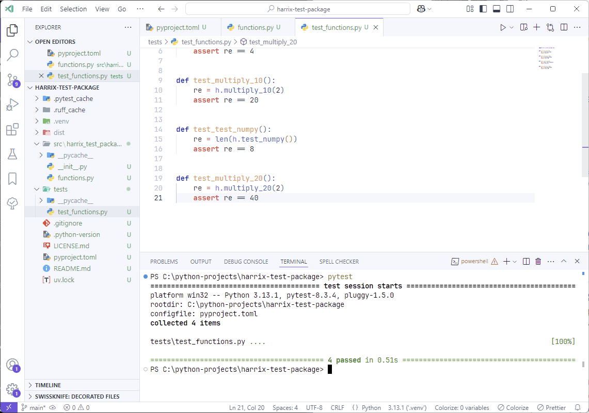

_Рисунок 21 — Тестирование пакета_

В файле `pyproject.toml` поменяем номер версии пакета на следующую, у меня это `0.8`:

```toml
[project]
name = "harrix-test-package"
version = "0.8"
description = "Test package"
readme = "README.md"
authors = [{ name = "Anton Sergienko", email = "anton.b.sergienko@gmail.com" }]
requires-python = ">=3.13"
dependencies = ["numpy>=2.2.1"]
license = { file = "LICENSE.md" }

[project.urls]
Homepage = "https://github.com/Harrix/harrix-test-package"

[project.scripts]
harrix-test-package = "harrix_test_package:main"

[build-system]
requires = ["hatchling"]
build-backend = "hatchling.build"

[dependency-groups]
dev = ["isort>=5.13.2", "pytest>=8.3.4", "ruff>=0.8.6"]
```

Собираем и публикуем пакет. Токен, конечно, вставляете свой. И да, можно вызвать команду публикации пакета по другому, смотрите документацию.

```shell
uv build
uv publish --token pypi-Qwerty1234567890QwertyQwerty1234567890Qwerty1234567890Qwerty1234567890Qwerty1234567890Qwerty1234567890Qwerty1234567890Qwerty1234567890Qwerty1234567890Qwerty1234567890Qwerty12
```

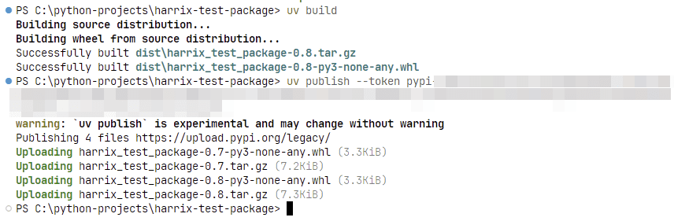

_Рисунок 22 — Публикация новой версии пакета_

Если вы шифровали токен, то надо будет ввести при публикации пароль.

В проектах, в котором использовался наш пакет обновляем его через команду:

```shell
uv sync --upgrade-package harrix-test-package
```

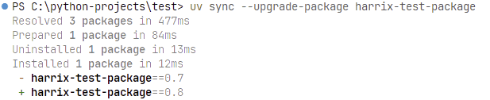

_Рисунок 23 — Обновление пакета_

Или через `pip install harrix-test-package --upgrade`, если ваш проект использует pip.

## Развертывание разработки пакета на новой машине

У нас есть, например, на GitHub [исходники](https://github.com/Harrix/harrix-test-package) нашего пакета, которые мы хотим склонировать на другой компьютер, например, в папку `c:\projects` (для примера папку специально назвал по-другому, чтобы она отличалась от `c:\python-projects`).

Считаем, что [Python](https://github.com/Harrix/harrix.dev-articles-2021/blob/main/install-python/install-python.md) | [🡥](https://harrix.dev/ru/articles/2021/install-python/), [Git](https://github.com/Harrix/harrix.dev-articles-2021/blob/main/install-git/install-git.md) | [🡥](https://harrix.dev/ru/articles/2021/install-git/), [uv](https://github.com/Harrix/harrix.dev-articles-2025/blob/main/uv-vscode-python/uv-vscode-python.md) | [🡥](https://harrix.dev/ru/articles/2023/uv-vscode-python/) и VSCode у вас установлены на новой машине.

Cклонировать проект можно такой командой:

```shell
mkdir c:\projects
cd c:\projects
git clone https://github.com/Harrix/harrix-test-package
cd c:\projects\harrix-test-package
```

Или вы просто копируете как-нибудь свой проект на другую машину (да хоть через флешку).

Пишем команду для создания виртуального окружения с теми же самыми библиотеками, что были в проекте. Это прописано в файле `uv.lock`:

```shell
uv sync
```

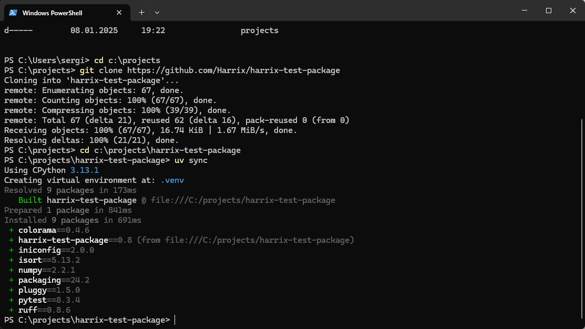

_Рисунок 24 — Выполнение команд в терминале_

Я выполнял команды в терминале, но вы можете спокойно их выполнять и в VSCode.

Теперь проект можете открыть в VSCode:

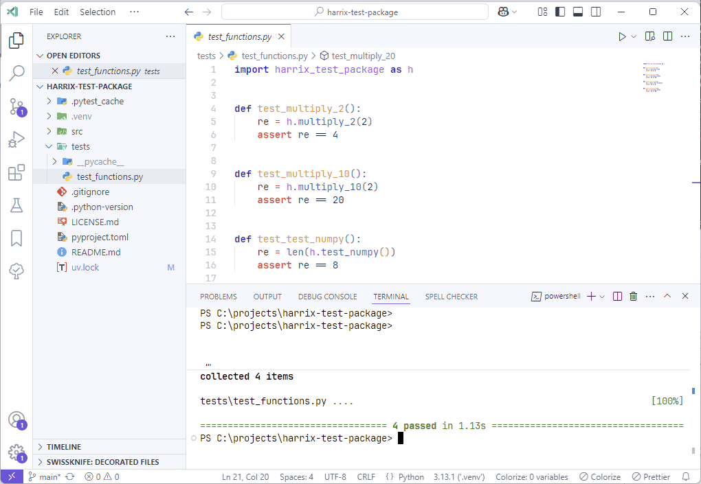

_Рисунок 25 — Проект открытый в VSCode с запущенными тестами_

Всё. Можете спокойно работать со своим проектом.

## Установка локального пакета

Если вы пока не хотите публиковать разрабатываемый пакет, но хотите использовать его в другом проекте, то его можно установить локально:

```shell
uv add c:/python-projects/harrix-test-package
```

В качестве `c:/projects/harrix-test-package` выступает путь, где находится локальный пакет.
