# Установка и работа с uv (Python) в VSCode


Расскажу о uv как о замене pip, Poetry и PDM и др. на примере Windows и VSCode.

<details>
<summary>📖 Содержание</summary>

## Содержание

- [Кратко](#кратко)
- [Ссылки](#ссылки)
- [Подготовка](#подготовка)
- [Установка uv](#установка-uv)
- [Создание проекта](#создание-проекта)
- [Создание виртуального окружения](#создание-виртуального-окружения)
- [Написание кода и его запуск](#написание-кода-и-его-запуск)
- [Добавление библиотек](#добавление-библиотек)
- [Форматирование кода](#форматирование-кода)
- [Дополнительные команды для uv](#дополнительные-команды-для-uv)
- [Тестирование](#тестирование)
- [Развертывание проекта на новой машине](#развертывание-проекта-на-новой-машине)
- [Выбор другой версии Python](#выбор-другой-версии-python)
- [Сборка EXE файла](#сборка-exe-файла)
- [Создание пакетов](#создание-пакетов)

Еще совсем недавно агитировал за Rye вместо pip, Pipenv, Hatch, Poetry и PDM. Но сам автор Rye передал свой проект создателям uv и агитирует переход в uv.

Но вся работа очень и очень похожа на работу в Rye. Не просто так эти программы объединились. Хотя на данный момент не всё так просто, как в Rye: Ruff надо ставить отдельно встроенной работы с тестами нет и др.

</details>

## Кратко

Создаем, например, проект `test-uv`.

- Установить [uv](https://docs.astral.sh/uv/).
- `uv init test-uv` — создать проект `test-uv`.
- Открыть папку проекта `test-uv` в VSCode.
- `uv sync` — создать виртуальное окружение.
- Выбрать в VSCode созданное виртуальное окружение.
- В `hello.py` написать код и запустить его.
- Чтобы развернуть проект на другой машине, то установите uv и примените `uv sync`.

Команды для работы:

- `uv init example` — создать папку `example` с файлами проекта uv.
- `uv init` — создать проект uv в текущей папке.
- `uv init --package example-pkg` — создать проект-пакет, который потом будет публиковаться.
- `uv add cowsay` — добавляем новую библиотеку.
- `uv add --dev isort` — добавляем новую библиотеку для режима разработки.
- `ruff format` — форматирование Python файлов проекта (после `uv add --dev ruff`).
- `ruff check` — проверка Python файлов проекта.
- `uv self update` — обновление самого uv.
- `uv sync` — зафиксировать библиотеки и обновить файлы виртуального окружения по `.lock` файлам.
- `uv sync --upgrade` — обновление всех библиотек проекта.
- `uv sync --upgrade-package cowsay` — обновление конкретной библиотеки.
- `uv remove cowsay` — удаление библиотеки.
- `pytest` — запускает тесты на базе `pytest` (после `uv add --dev pytest`).
- `uv python install 3.13` + `uv python pin 3.13` + `uv sync` — переключает на другую версию Python.
- `pyinstaller -F hello.py` — генерирует EXE файл (после `uv add --dev pyinstaller`).
- `uv build` — собирает библиотеку.
- `uv publish --token <pypi-token>` — публикация библиотеки на PyPI.

## Ссылки

- [uv](https://docs.astral.sh/uv/) — сайт инструмента.
- [Создание пакетов в Python через uv](https://github.com/Harrix/harrix.dev-articles-2025/blob/main/create-python-package-uv/create-python-package-uv.md) | [🡥](https://harrix.dev/ru/articles/2025/create-python-package-uv/).

## Подготовка

<details>
<summary>Установка программ и создание папки для проектов</summary>

Python не обязателен, так как uv умеет сам устанавливать и управлять Python.

Нужен VSCode. Если его нет, то смотрите статью [Установка Visual Studio Code (простая)](https://github.com/Harrix/harrix.dev-articles-2021/blob/main/install-vscode-simple/install-vscode-simple.md) | [🡥](https://harrix.dev/ru/articles/2021/install-vscode-simple/).

Нужно расширение Python в VScode:


_Рисунок 1 — Установка расширения Python_

Не забудьте перейти в раздел файлов:


_Рисунок 2 — Раздел Explorer_

Создайте любым способом на компьютере папку, где будут располагаться проекты, например, `C:\python-projects`, если у вас еще нет папки для Python проектов (например, через команду `mkdir C:\python_projects\` или просто через проводник). Через `File` → `Open Folder...` откройте эту папку (там тоже через окно открытия папки можно создать нужную папку):

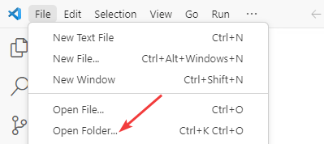

_Рисунок 3 — Открытие папки_

Вас спросят о том, доверяете ли вы авторам этой папки. Но ведь эту папку вы только что создали? Так что доверяем:


_Рисунок 4 — Подтверждение доступа к папке_

И включите режим автосохранения, чтобы не забывать сохранять изменения в файле:


_Рисунок 5 — Режим Auto Save_

</details>

## Установка uv

Идем на страницу установки <https://docs.astral.sh/uv/getting-started/installation/>. Там находим раздел установки под Windows. Нам предлагают установить не через стандартный EXE, а через PowerShell:

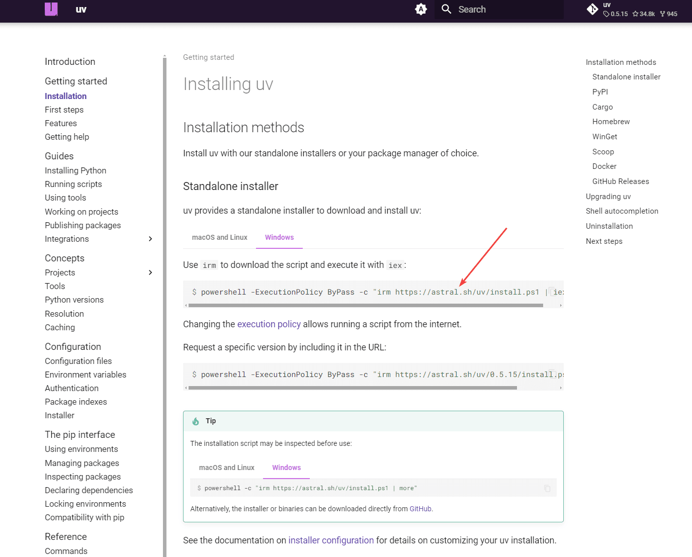

_Рисунок 6 — Команда установки для Windows_

Открываем Windows Terminal, PowerShell или тот же VScode (там нужен терминал) и там вводим команду

```shell
powershell -ExecutionPolicy ByPass -c "irm https://astral.sh/uv/install.ps1 | iex"
```

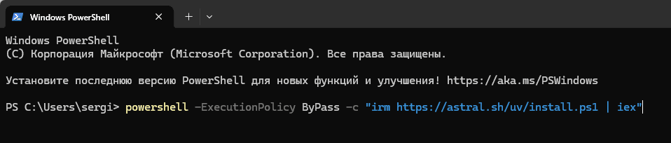

_Рисунок 7 — Начало установки_

После этого нам предлагают либо перегрузить компьютер, либо командой добавить путь к uv в системную переменную `PATH`:

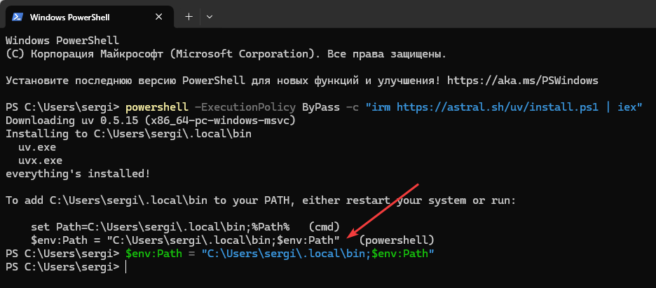

_Рисунок 8 — Предложение о добавлении пути в PATH_

Выбрал путь командой, и ввел `$env:Path = "C:\Users\sergi\.local\bin;$env:Path"`, но у вас будет другая команда, так как у вас пользователь будет называться по другому!

Установите Python, который будет управляться с помощью uv (будет устанавливаться последняя версия):

```shell
uv python install
```

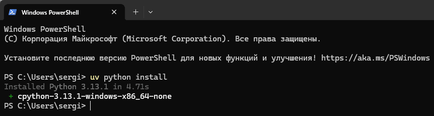

_Рисунок 9 — Установка Python_

Если вам будет нужна другая версия Python, то их можно установить через подобную команду `uv python install 3.12`.

## Создание проекта

Закройте VSCode и откройте его заново, если вы при установке uv его не закрывали.

Вызываем консоль в VSCode `Ctrl` → `` ` `` (`Ctrl` → `Ё`), прописываем команду создания нового проекта (после ввода команды не забываем нажать `Enter`). Вместо `test-uv` введите имя своего проекта (не используйте нижнее подчеркивание вместо дефиса):

```shell
uv init test-uv
```

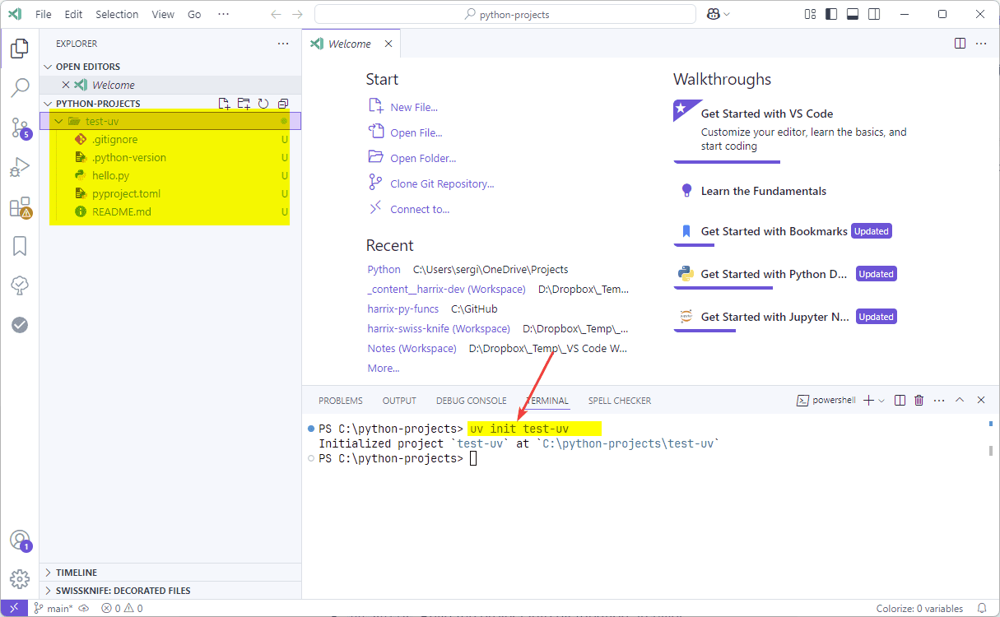

_Рисунок 10 — Инициализация проекта_

Кстати, можно инициализировать проект в текущей любой папке в терминале просто командой `uv init`, и текущая папка станет папкой проекта (вроде бы в Rye этого не было, и эта возможность мне нравится).

В результате появилась папка со всеми нужными файлами. Обратите внимание, что не создается сложная структура проекта с папкой `src\test_uv`, как в Rye, так как для простых приложений по мнению uv не нужна сложная структура. И тестовый файл `hello.py` создается в корне нашего проекта. А для создания пакета нужно было создавать проект через `uv init --package test-uv`.

Можно командой `cd test-uv` перейти в папку проекта. Но лучше сразу откройте через `File` → `Open Folder...` вновь созданную папку `C:\python-projects\test-uv` и откройте терминал `Ctrl` → `` ` `` (`Ctrl` → `Ё`). В дальнейшем в статье буду исходить, что открыта именно папка в VSCode:

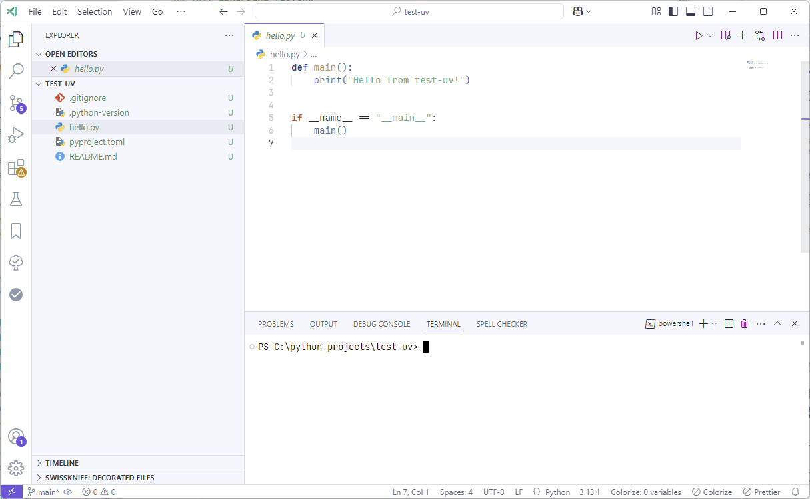

_Рисунок 11 — Открытая папка проекта test-uv_

## Создание виртуального окружения

Теперь нужно создать виртуальное окружение через команду:

```shell
uv sync
```

Папка виртуального окружения будет создана в папке с проектом:

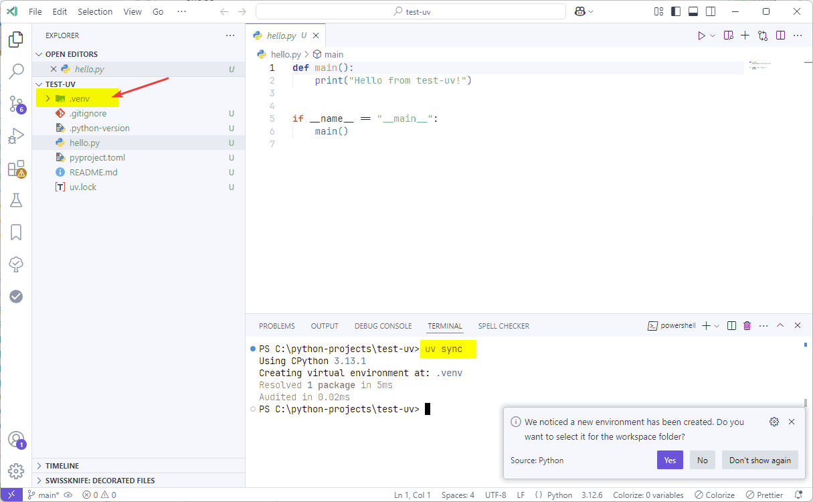

_Рисунок 12 — Созданное виртуальное окружение_

В других системах при работе с виртуальным окружением нужно следить, чтобы в терминале название виртуального окружения отображалось в круглых скобках, что означает активацию виртуального окружения:


_Рисунок 13 — Отображение названия виртуального окружения в терминале_

В uv это не обязательно, так как он сам следит за тем, чтобы запускались скрипты в нужном виртуальном окружении. Это можно проверить, введя команду в терминал:

```python
python -c "import sys; print(sys.prefix)"
```

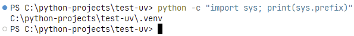

_Рисунок 14 — Путь к текущему виртуальному окружению_

Будет видно, что используется виртуальное окружение нашего проекта.

Однако VScode всё равно надо научить запускать самостоятельно нужное виртуальное окружение, когда VSCode сам запускает Python скрипты. Но об этом ниже в следующем разделе. Но на скриншоте выше видно, что VSCode нашел виртуальное окружение, и можно согласится на его использование.

Основные настройки проекта находятся в файле `pyproject.toml`, а также есть файл фиксирования библиотек проекта `uv.lock`.

## Написание кода и его запуск

Откроем созданный файл `hello.py`, чтобы протестировать запуск какого-нибудь Python скрипта (вторая строка для проверки запуска правильного виртуального окружения):

```python
print(2+2)

import sys; print(sys.prefix)
```

Проверим, что VSCode правильно подхватил виртуальное окружение `.venv`. Для этого смотрим внизу справа в панели состояния VSCode. Если там общее виртуальное окружение отображено (как на рисунке), то нажимаем на него и выбираем наше окружение `.venv`:

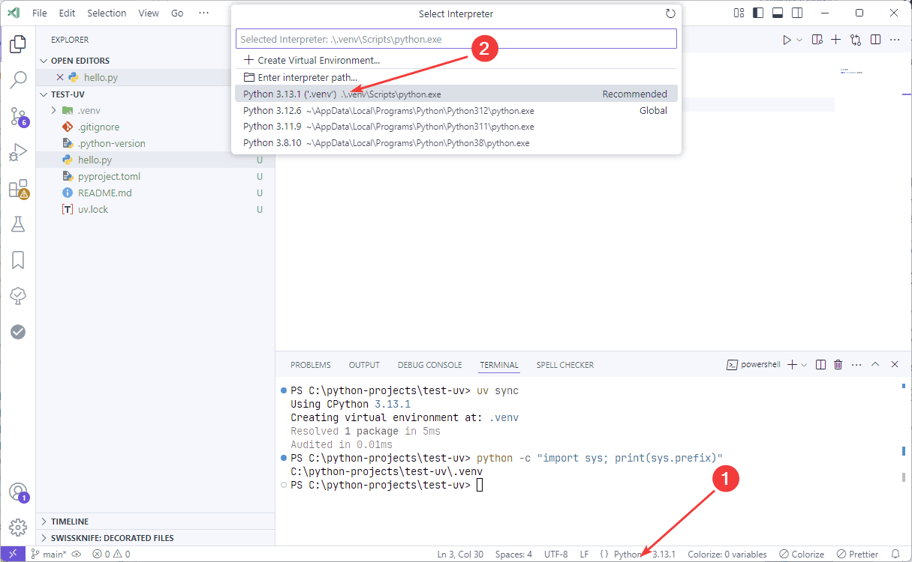

_Рисунок 15 — Выбор виртуального окружения в VSCode_

Запускаем кнопкой запуска сверху справа:

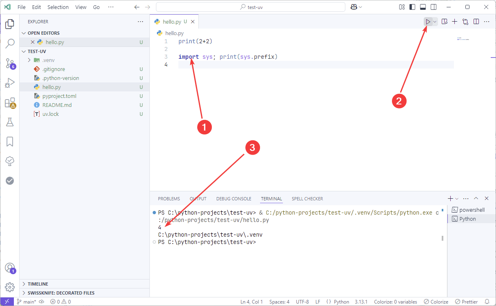

_Рисунок 16 — Запуск Python кода_

Если вы получили нужный вывод, то всё работает. Также проверьте, что путь к виртуальному окружению правильно выводится.

## Добавление библиотек

Добавление пакетов осуществляется через команду наподобие:

```shell
uv add cowsay
```

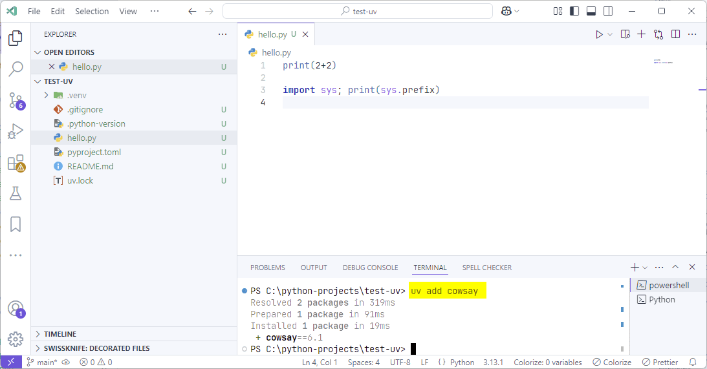

_Рисунок 17 — Добавление библиотеки_

Например, в `main.py` напишем такой код:

```python
import cowsay

cowsay.cow('Hello World')
```

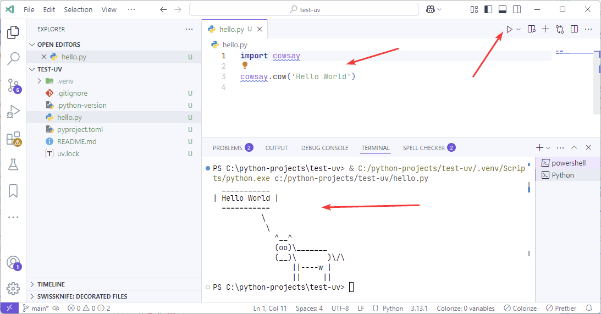

_Рисунок 18 — Запуск кода с установленной библиотекой_

Добавим ещё для примера библиотеку matplotlib:

```shell
uv add matplotlib
```

В `main.py` напишем такой код:

```python
import matplotlib.pyplot as plt
import numpy as np

x = np.linspace(-5, 5, 200)
y = x ** 2

fig, ax = plt.subplots()
ax.plot(x, y)
plt.show()
```

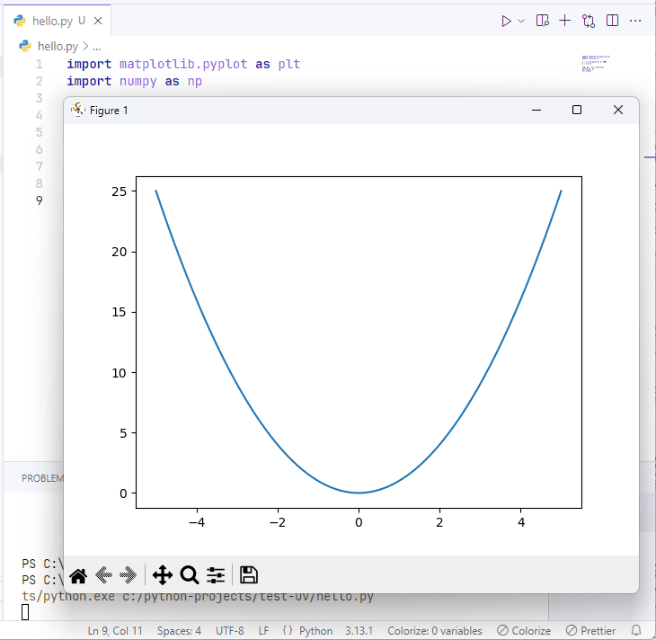

_Рисунок 19 — Вывод графика_

Если вам нужны в проекте библиотеки для разработки, то есть они не будут нужны потом пользователю вашей библиотеки, если вы её будете публиковать, то устанавливаем их с параметром `--dev`. Например, вам в самом проекте при его написании надо сортировать импорты [isort](https://pypi.org/project/isort/). Вам эта библиотека нужна как разработчику библиотеки, но пользователям вашего проекта не нужна. Тогда устанавливаем его вот так:

```shell
uv add --dev isort
```

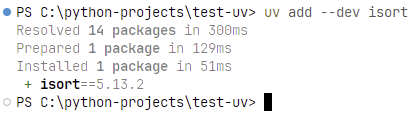

_Рисунок 20 — Установка пакета isort_

## Форматирование кода

В Rye встроена библиотека [Ruff](https://pypi.org/project/ruff/) для форматирования кода. А в uv нет, хотя этот пакет является их же творчеством. Так что нужно её установить И её можно использовать сразу для всех файлов проекта:

```shell
uv add --dev ruff
```

Тогда использовать библиотеку можно как:

```shell
ruff format
```

Был вот такой кода:

```python
import matplotlib.pyplot as plt
import    numpy as   np

x =    np.linspace( -5, 5,    200)
y = x**2
fig, ax =    plt.subplots()
ax.plot(x,    y)
plt.show()
```

Стал вот такой код:

```python
import matplotlib.pyplot as plt
import numpy as np

x = np.linspace(-5, 5, 200)
y = x**2
fig, ax = plt.subplots()
ax.plot(x, y)
plt.show()
```

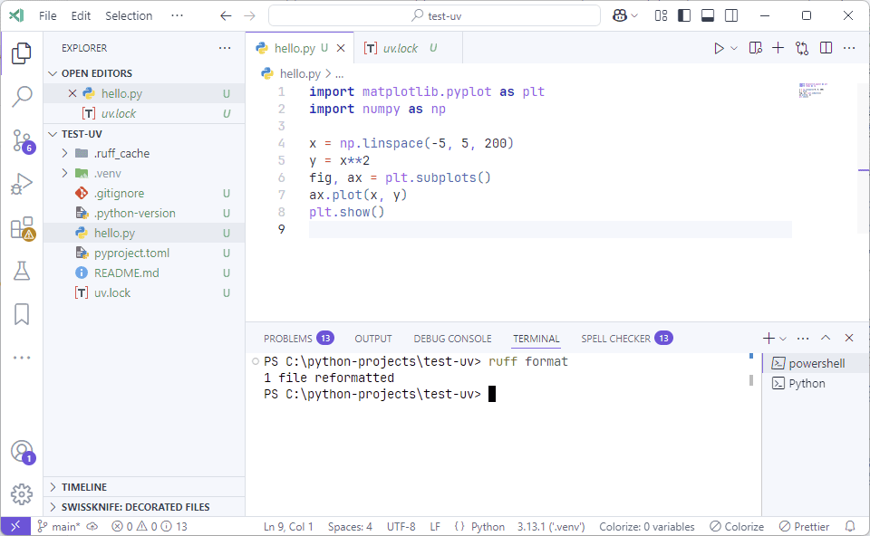

_Рисунок 21 — Форматирование Python кода_

Для форматирования кода в 120 символов можно в `pyproject.toml` вставить строчки представленные ниже и тогда можно использовать `ruff format`:

```toml
[tool.ruff]
line-length = 120
```

Если вдруг вы видите такую ошибку, то возможно еще не все настройки применились. Мне в таком случае помогает перезагрузка компа.

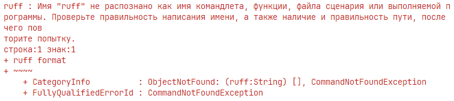

_Рисунок 22 — Ошибка нахождения ruff_

## Дополнительные команды для uv

Чтобы обновить сам uv для последней версии воспользуйтесь командой:

```shell
uv self update
```

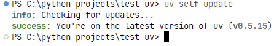

_Рисунок 23 — Обновление uv_

Чтобы зафиксировать библиотеки и обновить файлы виртуального окружения по `.lock` файлам, то используйте команду `uv sync` (также можно `uv lock`):

```shell
uv sync
```

Обновление всех библиотек в проекте можно так:

```shell
uv sync --upgrade
```

Если нужно обновить конкретную библиотеку, например, `cowsay`, то это можно сделать следующей командой:

```shell
uv sync --upgrade-package cowsay
```

Если какой-то пакет вам не нужен, то удаляем так:

```shell
uv remove cowsay
```

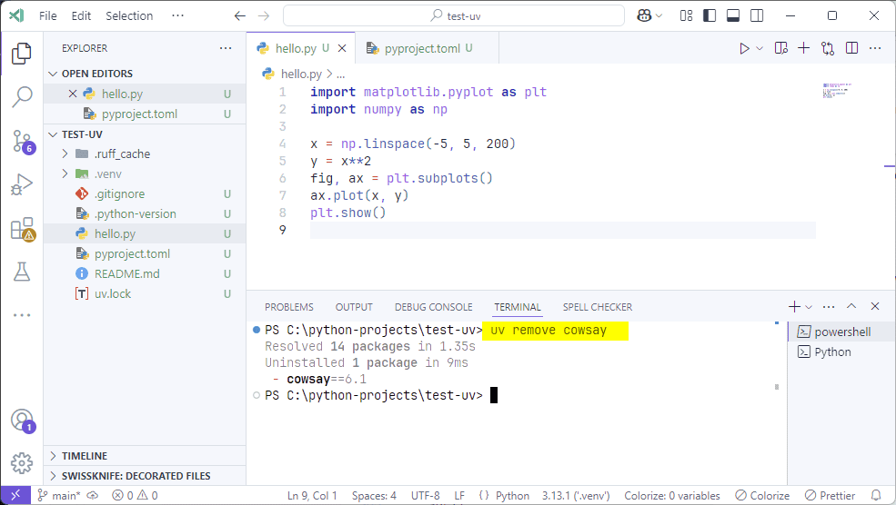

_Рисунок 24 — Удаление библиотеки_

Для проверки кода на наличие ошибок можно использовать линтер с ruff, который мы установили выше (`uv add --dev ruff`):

```shell
ruff check
```

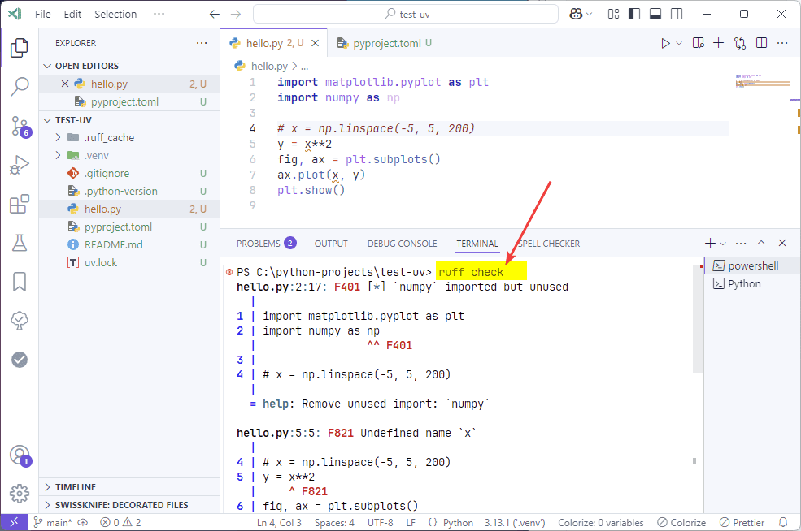

_Рисунок 25 — Пример сообщения об ошибке_

## Тестирование

Так как в Rye базовым пакетом для тестирования был `pytest`, то также с ним будем в uv работать:

```shell
uv add --dev pytest
```

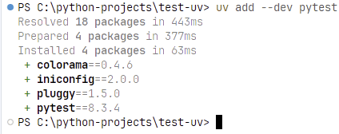

_Рисунок 26 — Установка pytest_

Теперь в файле `hello.py` (конечно этот файл можно переименовать или переместить в папку `src`) напишем, например, такие функции, которые хотим протестировать:

```python
def multiply_2(x):
    return x * 2

def multiply_10(x):
    return x * 10

def multiply_20(x):
    return x * 20

def multiply_30(x):
    return x * 30
```

Создайте папку `tests` в корне своего проекта:

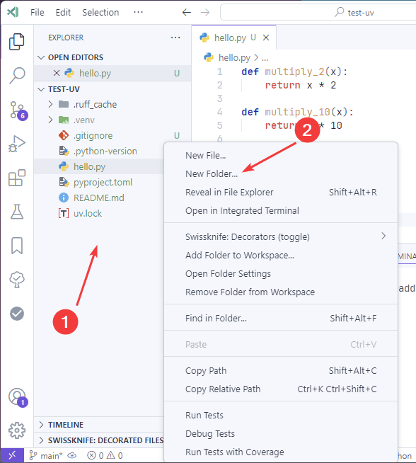

_Рисунок 27 — Создание папки tests через правый клик в explorer_

В неё создайте файл, например, `test_hello.py`:

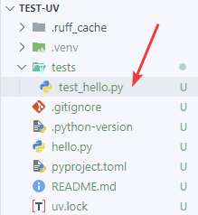

_Рисунок 28 — Созданный файл test_hello.py_

Обратите внимание, что файл должен начинаться с `test_`. То есть если вы назовёте файл, например, `test.py`, `tests.py`, `testhello.py`, `for_test.py`, то `pystest` не будет находить тесты (можно настроить, но лучше так не делать).

Пакет `pytest` должен понять, где находятся наш основной код. Для этого в файле `pyproject.toml` в конце прописываем строчки настройки `pystest`:

```toml
[tool.pytest.ini_options]
pythonpath = "."
```

Если вы располагаете код в папке `src` или любой другой, а не в корне проекта, как сейчас, то пропишите подобные настройки (не пропустите пробел после точки):

```toml
[tool.pytest.ini_options]
pythonpath = ". src"
```

Теперь в файле `test_hello.py` можем прописать простейшие тесты наших функций:

```python
from hello import *


def test_multiply_2():
    re = multiply_2(2)
    assert re == 4


def test_multiply_10():
    re = multiply_10(2)
    assert re == 20


def test_multiply_20():
    re = multiply_20(2)
    assert re == 40


def test_multiply_30():
    re = multiply_30(2)
    assert re == 60
```

Если у вас файл `hello.py` располагался в папке `src\test_uv\`, то первая строчка выглядела бы как `from src.test_uv.hello import *`.

Функции тестов должны также начинаться с `test_`.

Теперь в терминале вызываем команду запуска тестов:

```shell
pytest
```

Если всё правильно сделали, то тесты должны успешно быть пройдены:

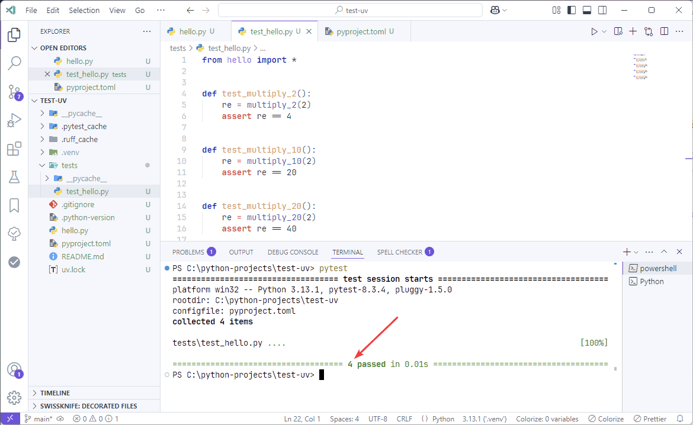

_Рисунок 29 — Успешный запуск тестов_

## Развертывание проекта на новой машине

Теперь представим, что вы успешно написали свой проект и хотите теперь запустить на другой машине. Как быть?

Чтобы развернуть проект на другой машине, то установите uv и примените `uv sync`.

На другой компьютер вы переносите папку проекта `test-uv` (или как он у вас там называется). Для приведенного выше примера нам нужны следующие файлы из первоначальной папки:

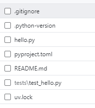

_Рисунок 30 — Файлы проекта_

То есть папки `.pytest_cache`, `__pycache__`, `.ruff_cache`, `.venv` вам не нужны. Они нужны конкретно вашей локальной версии проекта. Если вы используете Git, то благодаря файлу `.gitignore` лишние папки не попадут в переносимую папку.

На компьютере устанавливаете опять uv и VSCode, открываете папку `test-uv` в VSCode:

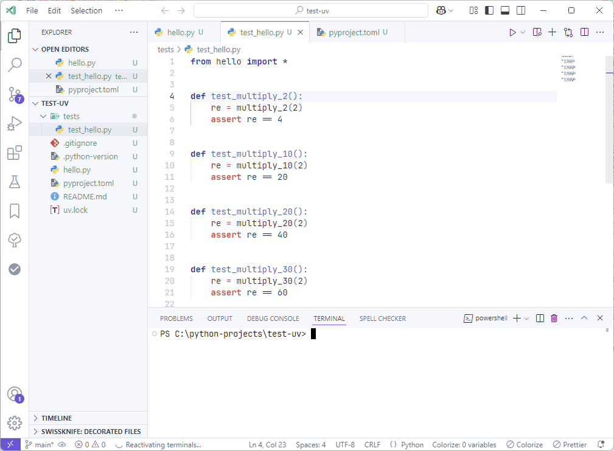

_Рисунок 31 — Проект открытый в VSCode_

Пишем команду для создания виртуального окружения с теми же самыми библиотеками, что были в проекте. Это прописано в файлах `uv.lock`:

```shell
uv sync
```

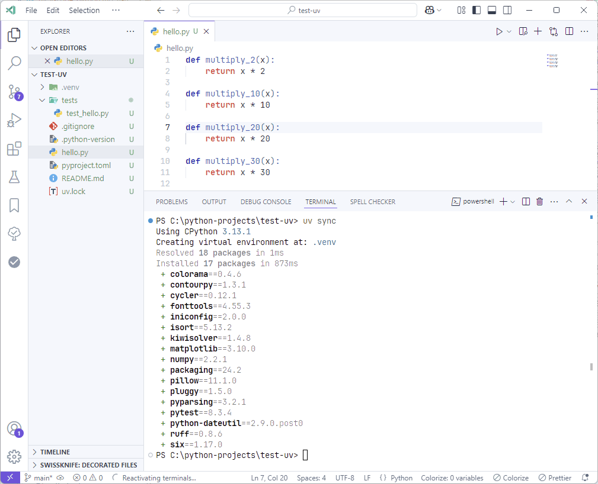

_Рисунок 32 — Проект открытый в VSCode_

Выбираем в VSCode виртуальное окружение из папки `.venv` (VSCode скорее всего даже предложит поменять виртуальное окружение самостоятельно).

Теперь можно запускать код. Я для примера вставил код выше для тестирования `matplotlib`:

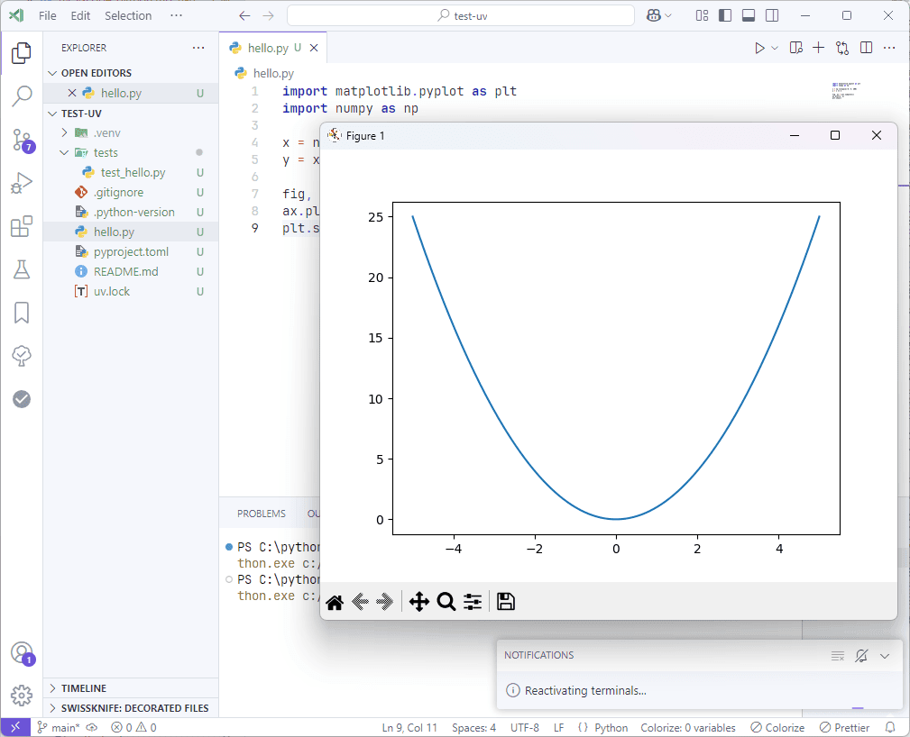

_Рисунок 33 — Восстановленный проект на другой машине_

## Выбор другой версии Python

Вначале скачиваем нужную версию Python (например, хочу проверить работу на старом или наоборот новом Python):

```shell
uv python install 3.11
```

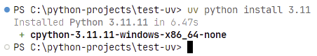

_Рисунок 34 — Скачивание новой версии Python_

Если вы делаете откат на более раннюю версию Python, то не забудьте в `pyproject.toml` поменять версию Python на более низкую:

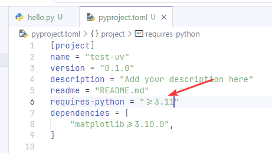

_Рисунок 35 — Пониженная версия Python_

Потом потом надо указать, что мы хотим переключиться на другую версию Python. Это команда приведет к изменению файла `.python-version`:

```shell
uv python pin 3.11.11
```

А потом надо переделать виртуальное окружение под новую версию Python:

```shell
uv sync
```

Всё. Теперь в VSCode отображается другая версия Python. Также это можно проверить через код:

```python
import sys
print(sys.version)
```

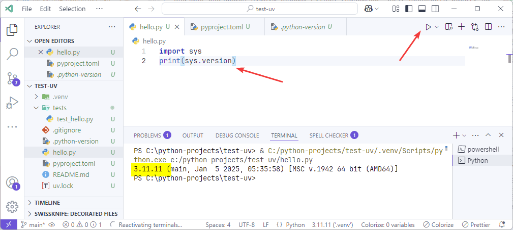

_Рисунок 36 — Скачивание новой версии Python_

Чтобы обратно перейти на старую версию Python, то меняем аналогично, только уже не скачивая версию:

```shell
uv python pin 3.13
uv sync
```

Аналогично поступаем для обновления текущей версии Python. Например, у вас стоит Python 3.11.8, а вышла версия 3.11.8. Простой команды я не нашел, но можно через тот же способ всё провернуть:

```shell
uv python install 3.11.9
uv python pin 3.11.9
uv sync
```

Посмотреть на последнюю версию Python, на которую вы хотите обновиться можно на сайтах [python.org](https://www.python.org/downloads/windows/) или [python-build-standalone](https://github.com/indygreg/python-build-standalone/releases).

## Сборка EXE файла

Попробуем собрать консольное приложение с таким кодом:

```python
a = int(input())
b = int(input())
print(a + b)

input("Press enter to exit.")
```

Для этого установим в режиме `--dev` пакет [pyinstaller](https://pyinstaller.org/en/stable/):

```shell
uv add --dev pyinstaller
```

После этого можно запустить pyinstaller:

```shell
pyinstaller -F hello.py
```

Если бы файл располагался в папке `src\test_uv\`, то код выглядел бы так:

```shell
pyinstaller -F src\test_uv\hello.py
```

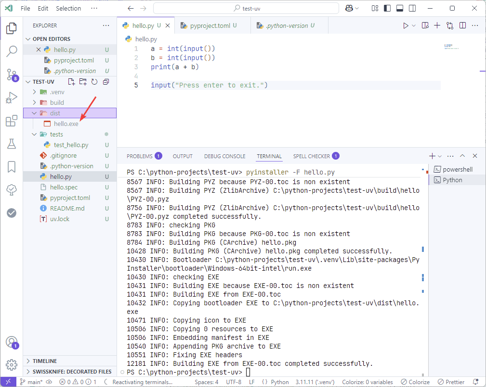

_Рисунок 37 — Генерация EXE файла_

Создаться папка `dist` с файлом `main.exe`.

Запускаем, вводим числа и видим:

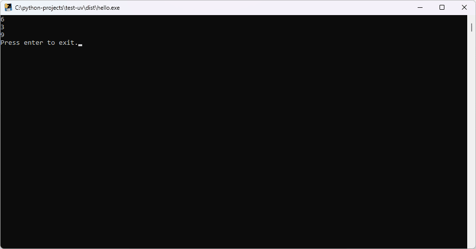

_Рисунок 38 — Результат выполнения программы_

Запуск EXE файлов был проверен на пустой Windows 11.

Если один файл не нужен, то не используйте флаг `-F`, а если нужно консольное приложение без консоли (то есть должно в фоне выполняться без создания черного окна терминала), то используйте флаг `--windowed`, например, `pyinstaller -F --windowed hello.py`.

## Создание пакетов

Читайте в отдельной статье [Создание пакетов в Python через uv](https://github.com/Harrix/harrix.dev-articles-2025/blob/main/create-python-package-uv/create-python-package-uv.md) | [🡥](https://harrix.dev/ru/articles/2025/create-python-package-uv/).
